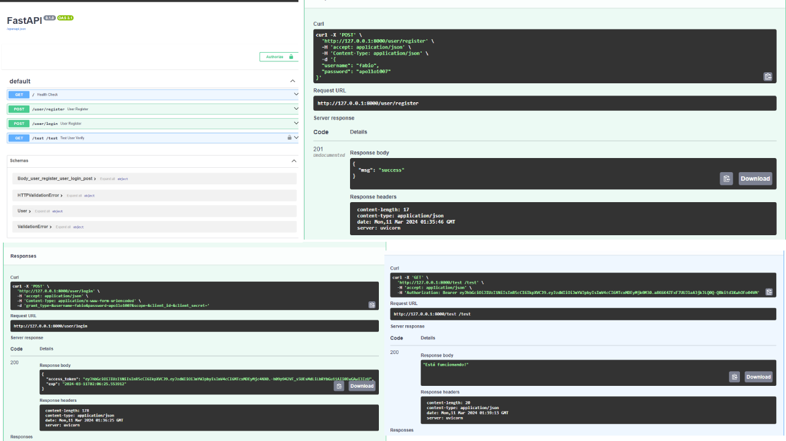

# API com autenticação no FastAPI com JWT em Python
Neste projeto, uma API foi desenvolvida utilizando o framework FastAPI em Python, integrando autenticação com JWT (JSON Web Tokens). 

As principais funcionalidades incluem rotas para registro de usuário (/register), login (/login) e autenticação JWT (/test). 

A documentação da API pode ser acessada na rota /docs, proporcionando uma visão abrangente das operações disponíveis e dos parâmetros necessários para interagir com a API de forma eficaz.

## Prepação do anbiente
Estou desenvolvendo no ambiente WSL com Ubuntu. Por favor, esteja ciente de que os comandos abaixo podem variar no ambiente Windows.

### Para iniciar um ambiente virtual no linux
````
poetry init
````
### Iniciar o ambiente virtual
````
poetry shell
````
### Fazer a instalação de pacotes
````
poetry add NOME_PACOTE
````

## Dependências
````
poetry add fastapi
````
````
poetry add uvicorn
````
````
poetry add sqlalchemy
````
````
poetry add psycopg2-binary
````
````
poetry add alembic
````
````
poetry add python-decouple
````
````
poetry add passlib
````
````
poetry add python-jose
````
````
poetry add python-multipart
````

### Comando para subir o PostgreSQL no docker
````
docker-compose up -d
````
### Inicializar as configurações das migrations
````
alembic init migrations
````
### Exportar o arquivo .env
````
source .env
````
### Criar as migrations
````
alembic revision --autogenerate -m "NOME_DA_MIGRTETION"
````
### Atualizar o banco de dados depois de criar uma migration
````
alembic upgrade head
````
### Rodando aplicação pelo uvicorn
````
uvicorn app.main:app
````